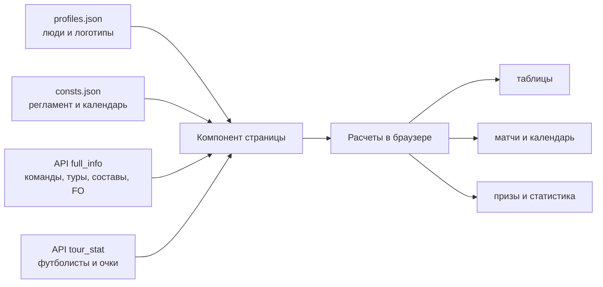

# Архитектура приложения

## Технологический стек

- Angular 16.2, модульный bootstrap через `AppModule`;
- standalone-компоненты для всех страниц и виджетов;
- Angular Router с `PathLocationStrategy`;
- `HttpClient` и RxJS (`forkJoin`, `BehaviorSubject`);
- SCSS, общие переменные и миксины в `src/app/styles`;
- Karma/Jasmine для unit-тестов;
- Lottie-loader: пакет `@lottiefiles/dotlottie-web` и внешний web-component script из unpkg.

Строгая проверка Angular-шаблонов включена, но три основных больших компонента используют `// @ts-nocheck`, а `strict` TypeScript выключен. Поэтому интерфейсы в `models/` описывают лишь часть фактической модели.

## Запуск

`src/main.ts` загружает `AppModule`. Модуль подключает браузер, router, `HttpClientModule`, корневой standalone-компонент и HTTP-interceptor загрузчика.

`AppComponent` содержит общую оболочку:

```text
AppComponent
├── HeaderComponent
└── router-outlet
    └── выбранная страница турнира
```

Тема оболочки (`ucl`, `cwc`) и подзаголовок header определяются строкой текущего турнира в `DataService.urlName$`.

## Маршруты

| Route | Компонент | Примечание |
|---|---|---|
| `/` | `MainPageComponent` | главная навигация |
| `/spain/new` | `LeagueH2HPageComponent` | актуальная Ла Лига |
| `/spain` | `LeaguePageComponent` | архивная реализация |
| `/champions-league/new` | `LeagueH2HPageComponent` | актуальная ЛЧ |
| `/champions-league` | `LeaguePageComponent` | архивная реализация |
| `/world-cup/new` | `LeagueH2HPageComponent` | ЧМ-2026 |
| `/spain-cup` | `CupPageComponent` | пока пусто |
| `/club-world-cup` | `CWCPageComponent` | КЧМ-2025 |

Неизвестный route перенаправляется на `/`. Страницы турниров загружаются лениво через `loadComponent`.

Query-параметр `year` фактически обязателен: компоненты обращаются к `profiles[year]`. На главной все ссылки задают его явно. Число обозначает год начала сезона: `year=2025` соответствует 2025–26.

H2H-страница также сохраняет состояние вкладок в query-параметрах (точный набор задается методами `setQueryParam` и `updateTabs`).

## Основной поток данных



Все основные страницы выполняют вложенную последовательность:

1. параллельно читают `profiles.json`, `consts.json`, `teams.json`;
2. выбирают сезонную конфигурацию по `type` route и `yearStart`;
3. запрашивают один или два `squad_link`;
4. при двух этапах сшивают туры и накопительные результаты;
5. рассчитывают рейтинг, медали и представления для таблиц;
6. при необходимости запрашивают `tour_link + номер_тура` для метаданных футболистов и специальных призов.

`LoaderInterceptor` вызывает loader для каждого HTTP-запроса и скрывает его через секунду после завершения. Сейчас loader хранит только boolean, поэтому параллельные запросы могут преждевременно скрыть индикатор.

## Страницы и ответственность

### `LeagueH2HPageComponent`

Главная реализация сезона 2025–26. Компонент одновременно:

- загружает и объединяет данные;
- считает результаты каждого H2H-матча;
- строит Apertura, Clausura, Common и таблицы отдельных лиг;
- считает кубковые показатели;
- считает стоимость состава, замены, серии и уникальных футболистов;
- вычисляет призовые номинации по id приза;
- управляет всеми вкладками и query-параметрами;
- готовит модели для дочерних таблиц.

Часть чистой расчетной логики вынесена в `LeagueH2HDataService`: результат матча, FO, победы/ничьи/поражения, серии, стоимость, замены и агрегирование Common.

Алгоритм H2H:

1. взять `tour_score` хозяина и гостя из `squads.data.players[id].team.results_by_tour[tour]`;
2. если абсолютная разница `<= drawGap`, зафиксировать ничью (для play-off порог обычно принудительно равен нулю);
3. начислить H2H-очки 3/1/0;
4. обновить FO, пропущенные FO и разницу;
5. обновить серии и призовые счетчики;
6. агрегировать Apertura + Clausura в Common.

### `LeaguePageComponent`

Архивная страница 2024–25. Показывает общий рейтинг по внешним фэнтези-очкам, медали за туры, изменения позиций и статистику использованных футболистов/трансферов. Собственный H2H-календарь здесь не рассчитывается.

### `CWCPageComponent` и `CwcDataService`

Отдельная модель командного КЧМ-2025:

- 12 команд по 3 профиля;
- три группы по четыре команды;
- три групповых тура;
- дополнительный отборочный тур;
- четвертьфинал, полуфинал, финал и матч за третье место.

В каждой встрече профили двух команд попарно сравниваются по FO. Разница до 3 FO включительно дает ничью в индивидуальной встрече. Командный результат складывается из индивидуальных встреч. Сортировка группы: H2H-очки, разница «голов» встреч, разница FO.

Пары play-off в `consts.tours[].matches` задаются индексами внутри динамически сформированного массива команд, а не стабильными team id. Это делает порядок команд частью контракта.

### Дочерние компоненты

- `StandingsComponent` показывает позиции и туровую динамику.
- `ScheduleComponent` показывает расписание выбранного профиля и данные соперника.
- `MatchesComponent` показывает все встречи по турам.
- `PrizesListComponent` отображает уже рассчитанные номинации.
- `HeaderComponent` реагирует на `DataService.urlName$`.
- `DefaultLoaderComponent` отображает Lottie-анимацию по `LoaderService.isLoading$`.

## Рейтинг и медали

В трех больших страницах остается похожий код:

- участники сортируются по `total_score`;
- туровые места используются для подсчета gold/silver/bronze;
- рейтинг строится на коэффициентах `[19, 15, 12, 10, 9]` и относительных результатах;
- для цветовой шкалы тура вычисляются max, median и min;
- цвет интерполируется от красного через оранжевый/желтый к зеленому.

Реализация дублируется и является одним из первых кандидатов на общий доменный сервис.

## Ошибки и наблюдаемость

- Глобального error view нет.
- Некоторые HTTP error callbacks пустые; остальные только пишут в `logger`.
- `logger` активен только на `localhost` и `127.0.0.1`.
- Retry, timeout и fallback на snapshots не реализованы.
- Локальные snapshots 2024–25 не подключаются автоматически и служат архивом/образцами.

## Сборка и публикация

Production build создается в `dist/fr-fantasy`, включает hashing и optimization. Лимит initial bundle: warning 500 KB, error 8 MB. Команда `mypage` задает `base-href=https://fr-fantasy.ru/`.

Так как используется `PathLocationStrategy`, production-сервер должен отдавать `index.html` для неизвестных frontend-маршрутов. Без SPA fallback прямое открытие URL даст 404.
